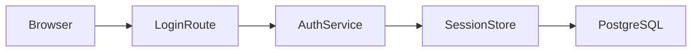

# Design Document

## Overview

Session-cookie based authentication built on the existing Fastify stack.
Passwords are hashed with argon2id; sessions live in PostgreSQL.

## Architecture

## Components and Interfaces

- `AuthService.signIn(email, password)` — validates credentials, creates a session
- `AuthService.signOut(sessionId)` — invalidates a session
- `SessionStore` — persistence and expiry sweep

## Data Models

- `users(id, email, password_hash, failed_attempts, locked_until)`
- `sessions(id, user_id, created_at, last_seen_at, expires_at)`

## Error Handling

- Invalid credentials and unknown emails return the same error shape
- Lockout responses use HTTP 429 with a Retry-After header

## Testing Strategy

- Unit tests for credential validation and lockout arithmetic
- Integration tests for the full sign-in/sign-out flow
- A clock-controlled test for the 30-minute expiry sweep
